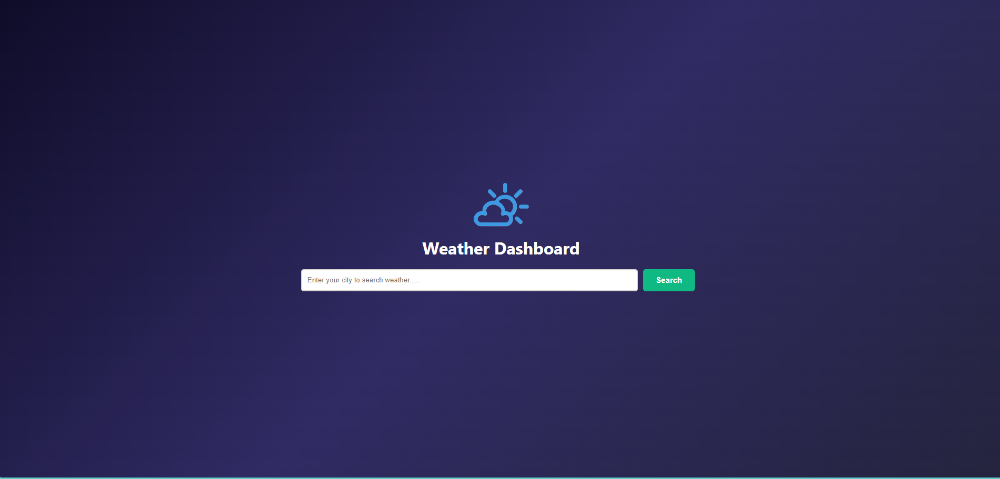
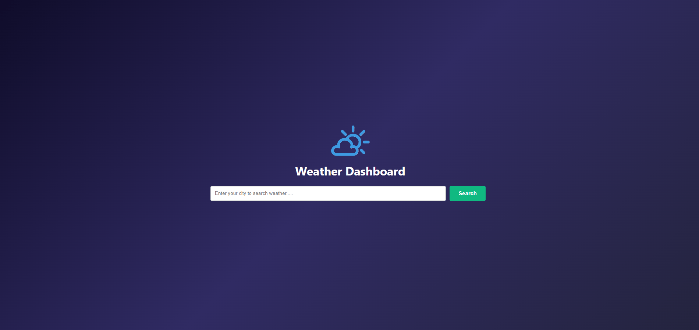

# 🌦️ Weather Dashboard

A responsive Weather Dashboard built using **Vanilla JavaScript**, **HTML5**, and **CSS3** that allows users to search for real-time weather information by city. The application integrates with the **OpenWeather API** to display current weather conditions in a clean and user-friendly interface.

---

## 🚀 Live Demo

> **GitHub Pages:** *(https://gaurav-fullstack.github.io/weather-dashboard/)*

---

## 📸 Preview

> 
   
  
>  

---

## ✨ Features

* 🔍 Search weather by city name
* 🌍 Displays city and country information
* 🌡️ Current temperature in Celsius
* 🤗 Feels Like temperature
* ☁️ Weather condition with dynamic icon
* 💧 Humidity
* 🌬️ Wind Speed
* 📅 Current weather timestamp
* ❌ Error card for invalid city names
* 📱 Responsive weather card layout
* 🧩 Modular JavaScript architecture using ES Modules

---

## 🛠️ Technologies Used

* HTML5
* CSS3
* Vanilla JavaScript (ES6+)
* Fetch API
* Async / Await
* OpenWeather API

---

## 📂 Project Structure

```text
weather-dashboard/
│
├── index.html
├── css/
│   └── style.css
├── js/
│   ├── app.js
│   ├── api.js
│   ├── ui.js
│   ├── utils.js
│   ├── elements.js
│   └── config.js
├── assets/
└── README.md
```

---

## ⚙️ Getting Started

### 1. Clone the repository

```bash
git clone https://github.com/your-username/weather-dashboard.git
```

### 2. Open the project

Open the project in **Visual Studio Code**.

### 3. Run the application

Since the project uses **ES Modules**, open it using a local development server.

For example, use the **Live Server** extension in VS Code.

---

## 🔑 API Configuration

This project uses the **OpenWeather API**.

1. Create a free account on OpenWeather.
2. Generate your API key.
3. Add your API key in the configuration file.

Example:

```javascript
export const API_KEY = "YOUR_API_KEY";
```

---

## 📚 Concepts Practiced

This project was built to strengthen core JavaScript and software engineering concepts.

* DOM Manipulation
* Event Handling
* Form Validation
* Fetch API
* Async / Await
* Error Handling
* API Integration
* JSON Parsing
* Data Normalization
* Template Literals
* ES Modules
* Separation of Concerns
* Single Responsibility Principle (SRP)
* Modular Project Structure

---

## 🚧 Future Improvements

* 📍 Detect current location
* 📅 5-Day Weather Forecast
* 🌫️ Air Quality Index (AQI)
* 🌙 Dark / Light Mode
* 🕒 Recent Search History
* ❤️ Favorite Cities
* 🌡️ Unit Conversion (°C / °F)
* ⏳ Loading Animation
* 📊 Additional Weather Metrics

---

## 💡 What I Learned

Building this project helped me understand how to structure a frontend application beyond simply making it work. I learned how to separate application logic into modules, consume and normalize REST API data, manage asynchronous operations using `async`/`await`, and build reusable UI rendering functions. Most importantly, it strengthened my understanding of writing maintainable, scalable JavaScript applications.

---

## 👨‍💻 Author

**Gaurav Sharma**

GitHub: https://github.com/gaurav-fullstack

---

## 📄 License

This project is created for learning and portfolio purposes.
